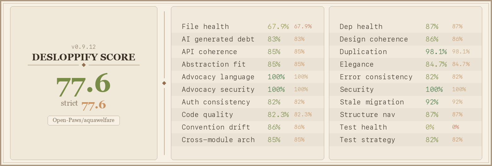

# 🌊 Aquatic Animal Welfare Tracker

[](scorecard.png)

**A next-generation, data-driven advocacy platform and strategic intelligence dashboard.**

The Aquatic Animal Welfare Tracker is a full-stack Next.js web application designed to empower NGOs, policymakers, and researchers. By aggregating global aquaculture production data, analyzing legislative strictness, and deploying simulated AI/ML forecasting models, this platform transforms raw statistics into actionable, compelling campaigns to protect billions of farmed aquatic animals globally.

---

## 🚀 Key Features

*   **🌍 Interactive Choropleth Map:** A visually stunning, dynamic geographic visualizer. Entire countries are color-coded based on their Welfare Gap Scores, allowing for instant identification of high-risk regions. Built with React-Leaflet and GeoJSON.
*   **📊 Strategic Intervention Simulator:** A "What-If" analysis engine. Toggle hypothetical policy interventions (e.g., *100% ASC Corporate Pledges* or *Legal Sentience Recognition*) to mathematically project exactly how many billions of individual animals would transition from unshielded to protected.
*   **🧠 Advanced Intelligence (AI) Suite:**
    *   **Predictive 2030 Forecasting:** A machine-learning style compound trajectory model highlighting the explosive growth of the aquaculture industry against stagnant legislative frameworks.
    *   **NLP Policy Sentiment Grader:** A JavaScript-based Natural Language Processing engine that scans drafted laws or corporate pledges, punishes "loophole" vocabulary (*"should", "voluntary"*), and grades the strictness of the policy objectively from A+ to F.
*   **⚠️ Welfare Gap Analysis Engine:** A sophisticated, multi-factor heuristic algorithm that computes an overall "Gap Score" for every species and country by weighing sentience evidence, regulatory enforcement, and certification coverage against massive production volumes.
*   **📋 Automated PDF Reporting:** Generate and download professional, structured advocacy reports in high-quality PDF formats (via `html2pdf.js`) optimized dynamically for print layouts.
*   **🐟 Granular Species & Country Databases:** Comprehensive profiles for 35+ species and 40+ countries utilizing updated framework metrics.

---

## 🛠️ Technology Stack

*   **Framework:** [Next.js 14](https://nextjs.org/) (App/Pages Router architecture)
*   **UI Library:** [React](https://reactjs.org/)
*   **Styling:** Custom CSS implementing a "Deep Ocean Glassmorphism" design system (Dark Mode optimized).
*   **Geospatial Mapping:** `react-leaflet` & `leaflet`
*   **Data Visualization:** `recharts` (Area, Radar, Bar, and Pie distributions)
*   **PDF Generation:** `html2pdf.js`
*   **Icons:** Emoji system & standard unicode iconography.

---

## ⚙️ Getting Started

Follow these steps to set up and run the tracker on your local machine.

### Prerequisites
Make sure you have [Node.js](https://nodejs.org/) (v16.x or newer) and `npm` installed.

### Installation

1. **Clone the repository:**
   ```bash
   git clone https://github.com/your-username/aquatic-welfare-tracker.git
   cd aquatic-welfare-tracker
   ```

2. **Install dependencies:**
   ```bash
   npm install
   ```

3. **Run the development server:**
   Because Next.js caching works alongside Leaflet map imports, the project runs best with the Webpack flag active.
   ```bash
   npm run dev
   # (This runs: next dev --webpack)
   ```

4. **Open the application:**
   Navigate to [http://localhost:3000](http://localhost:3000) in your browser.

---

## 📂 Project Structure

```text
aquatic-welfare-tracker/
├── app/                  # Next.js App Router (page.js, layout.js, globals.css)
├── components/           # React Interface Components
│   ├── AISuite.jsx       # The NLP and Forecasting ML Dashboards
│   ├── WorldMap.jsx      # The React-Leaflet Choropleth Geographic Renderer
│   ├── InterventionSimulator.jsx # The mathematical Gap reduction engine
│   └── ...
├── data/                 # The Static JSON Document Databases
│   ├── species.js        # 35+ species metrics and sentience thresholds
│   ├── countries.js      # Production metrics and legislative grades
│   └── welfare-standards.js
├── lib/                  # Core Business Logic & Algorithms
│   ├── gap-scoring.js    # Weighted algorithms for assigning Gap Scores
│   └── report-generator.js # Automated markdown formulation 
├── public/               # Static assets (GeoJSON map boundaries)
```

---

## 🎯 The Purpose

Approximately **100+ Billion** farmed fishes and **400+ Billion** farmed crustaceans are slaughtered annually, representing the largest group of exploited animals on Earth. However, they receive the least legislative protection. 

This tracking application solves the massive data-visibility problem for campaigners. By consolidating production volumes, certification coverages, and political gaps into one visceral, interactive dashboard, organizations can easily decide **where** and **how** to intervene to maximize the number of lives shielded.

---

## Code Quality



## 📝 License
This project is licensed under the MIT License. See the `LICENSE` file for details.
